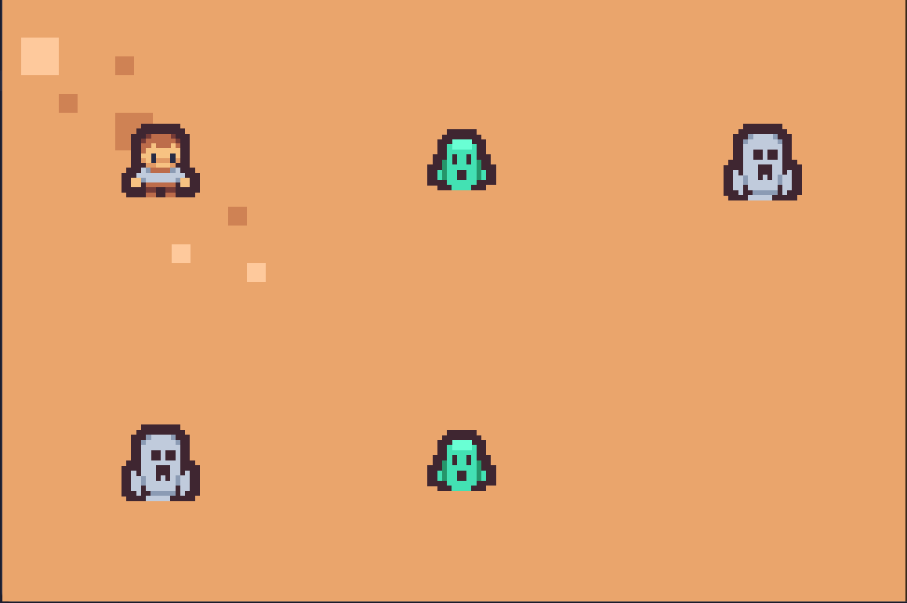

# Scale Hero

My unfinished and unsubmitted submission for [Game Off 2023](https://itch.io/jam/game-off-2023)

## Tech

- [Love2D](love2d.org/) - I don't like high level game engines, but I also don't like having to write _everything_ from scratch, so this framework proved to be actually pretty good for anything you could think of, even if it says it's only for 2D, there's a pretty well developed 3D framework which based off it, [LOVR](https://github.com/bjornbytes/lovr). So anything you learn to do with Love you can make with Lovr.
- [iffy](./lib/iffy.lua) - Slightly modified version of [iffy](https://github.com/besnoi/iffy). Very nice abstractions to work with sprites and quads in spritesheets.
- [object](./lib/object.lua) - Slightly modified version of [classic](https://github.com/rxi/classic). OOP for Lua! Really not necessary since you can totally make OOP with Lua tables and EmmyLua annotations, but this library utilities and its mixin implementation are super useful.
- [pprint.lua](./lib/pprint.lua) - Slightly modified version of [pprint](https://github.com/jagt/pprint.lua) to allow prefixes (I use it for coloring and basically make the logger tool work as expected). Helps printing stuff to stdout! The default print function lacks the ability to properly print tables and nested tables. See my overwrite [here](./src/__setup.lua#L10)
- [ansicolor.lua](https://github.com/randrews/color/tree/master) - Helps printing colors to stdout!
- [uuid.lua](https://github.com/Tieske/uuid/tree/master) - UUIDs in Lua. Used to ID objects.
- [flux](https://github.com/rxi/flux) - Tweening & easing functions. Used for animations
- [resolution-solution](https://github.com/Vovkiv/resolution_solution) - Responsive screens
- [timer](https://github.com/vrld/hump/blob/master/timer.lua) - For async-await capabilities
- [Hump.camera](https://github.com/vrld/hump/blob/master/camera.lua) - For camera

## Things I learned

1. Lua! Actually a pretty good language. Very barebones but pretty powerful, similar to javascript in a way, but with more control over things in my opinion. Easy to extend, easy to customize. All the libraries I brought in I ended up customizing / extending a little bit.
2. Sumneko annotations: an extension for the lua language server, allowing you to soft-type your code. Super useful since lua doesn't have custom types you can re-use.
3. Tweening and easing: In the past I could never achieve good tweens due to my lack of math skills. Throughout the development of Scale Hero, I took some time to also learn how tweening works.
4. Rendering optimizations: In the first few weeks of development I had horrible performance, the game was taking 90% of the CPU and sometimes even more. When I saw this I thought it was on the framework but decided to dive deep which led me to learn about SpriteBatch(es) and Spatial Partitioning (not implemented yet). SpriteBatch allows you to prerender the same texture a lot of times to a single image that will then be rendered altogether in a single call, before this, I was making a draw call for each tile / character I had, which caused poor performance. This is especially useful for large maps, in my case this game can totally have +5000 tiles, so this optimization was key.
5. Geometry: not present at the moment because I ended up using `resolution-solution`, but before that I was making my own responsive layout using nothing more than `love.graphics`, I was actually very close to achieve it but was missing a simple calculation I ended up finding in the library mentioned earlier.
6. OOP: Already knew OOP, but I feel like I have a better grasp of it now. I started off with ECS but it felt overkill for this type of game.
7. Events: I made my own kind of events system, I called them signals since it was super simple and not very event-ish really. Basically `actions` can emit signals, said signals can be `die`, `hit`, `get_hit_{axis}`... and they work in a 1->1 basis, meaning there's an emitter and only one "listener" that's not really a listener lol. Anyways it works fine for this use case, I couldn't find a library that offered event-driven architecture for Love2D. If you're interested, the Defold Engine has events built-in.
8. Lua coroutines: offers async-ish capabilities, I used it for my actions/events system. Basically signals are only emitted after the time for them to happen goes by. Lua doesn't have built-in async-await functionalities so I had to implement it through the `timer` library.

## Demo

https://www.youtube.com/watch?v=ThYaUONvkt8

## What works

- If you click the character will attack an enemy, in any direction.
- Enemies die after taking enough damage
- You can change the scales by pressing any key, `A` is reserved for increasing it, while any other is for decreasing it.

## Improvements

- Implement grid-based spatial partitioning for `level:mousemoved` in `level.lua`
- Update highlighted tile when re-scaling? probably not necessary unless scaling can happen while the player is doing something
- Make use of `love.graphics.scale` and `love.graphics.push` more, most of the math calculations done can likely be replaced using draw calls with them, instead of re-doing some calculations that happen for every tile and character.

## Personal Veredict

Of course I didn't get to finish the game, but I learned a lot of things and made most of this from scratch so I feel happy with it. It wouldn't be hard to add missing features and the rest of the game loop, in fact I might do it someday.
Love2D is pretty good and I loved working with Lua, I think this is perfect to get into game development, but not so much as to make full games with it, since we're lacking a lot of basic tools that allows the developer to iterate fast. Anyway, this is solid, and you could make about anything with it, but you may have to implement your own tooling for many things.
